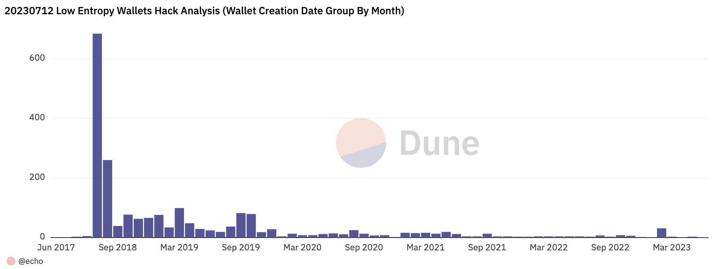
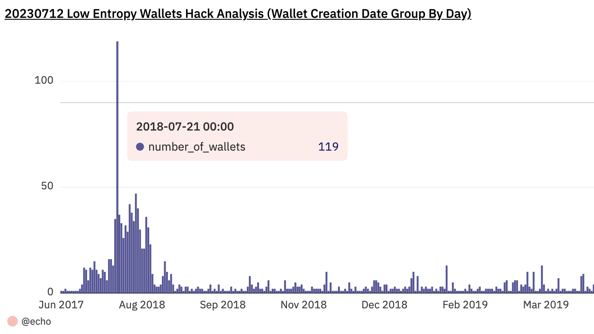
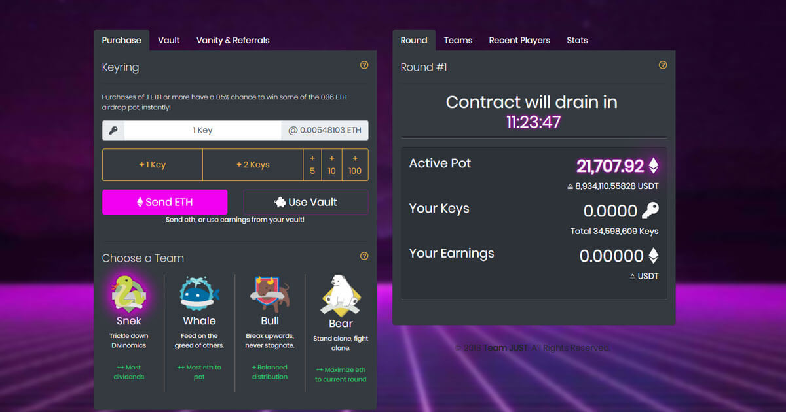
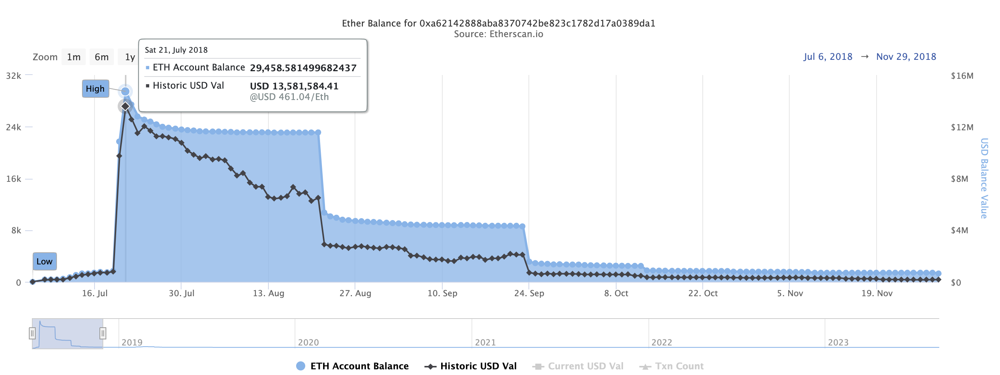
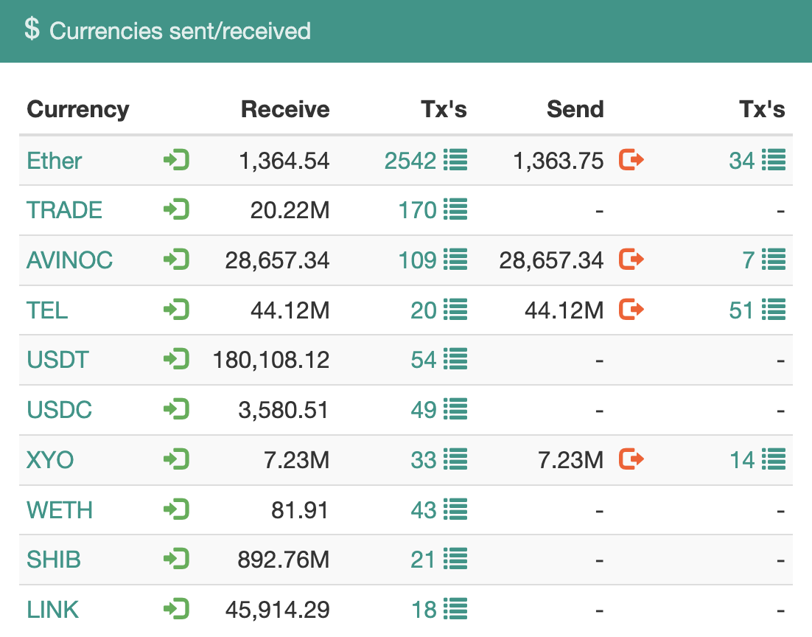

>Authors: [p0n1](https://twitter.com/ErrNil) and [outoflegend](https://twitter.com/outoflegend) from [SECBIT Labs](https://secbit.io/)

## How Did Our Investigation Begin?

On 2023-07-12, numerous ETH wallets were hacked, and the funds were transferred to the address 0xAa8B55e21ef3df5f15adf4d0F49D3bfa854e9125. Victims claimed to have used different crypto wallets, some even claiming they hadn't accessed their wallets for a long time. Some even said their wallets were air-gapped or used as cold storage.

These claims raised questions in our minds, hinting at something more significant. These questions prompted us to start the investigation.

## Were Single or Multiple Wallet Providers Affected? Why?

We have seen user reports on social media with at least three types of wallets, including Trust Wallet and Klever Wallet. Fortunately, @klever_io quickly responded to this hack, pointing out that it was related to an already-known exploit caused by low entropy mnemonic. It was similar to the one reported by [Trust Wallet's browser extension in April 2023](https://blog.ledger.com/Funds-of-every-wallet-created-with-the-Trust-Wallet-browser-extension-could-have-been-stolen). They also stated that this issue was not exclusive to Klever. Reports suggested that multiple wallet providers were affected, providing insight and direction into the possible reasons behind the hacking. However, **no other wallets** except @klever_io have confirmed the issue.

## When Were the Affected Wallets Created?

Investigating a crypto wallet hack requires detailed user reports, including wallet creation dates and the wallet brand or product version used. Unfortunately, we couldn't find enough affected users online, as many were unaware of the hack, and others couldn't recall their wallet creation details accurately. We opted to utilize on-chain data for quick analysis.

You can find more details and findings in our previous tweet thread [here](https://twitter.com/ErrNil/status/1679533412112293888).

> 1/🧵 Investigating the recent hack... many wallets created between 2017-06-30 and 2023-06-04 were affected! The most victims are from July 2018. Please check if you're one of them.

The hack is not limited to a single wallet. Many victims were hacked, transferring funds to 0xAa8B55e21ef3df5f15adf4d0F49D3bfa854e9125. A lack of reports online could be due to the affected addresses being old and unchecked.

Quick research on on-chain data using @DuneAnalytics provided important findings. The analytics dashboard can be found [here](https://dune.com/echo/2023-07-12-low-entropy-wallets-hack-analysis).

Most intriguing was the wallet creation date. A common vulnerability might link the hacked addresses. Some addresses never sent out any transactions, only receiving funds. The oldest wallet hacked was created on 2017-06-30, and the latest on 2023-06-04. It provides significant evidence that not a single provider was targeted, and the vulnerable product might still be in production. **Most addresses were created in 2018/2019, with the most being created in July and August 2018.**



However, this may not cover all the affected wallets, as the hacker might have scanned for addresses with value, and some wallets may still be unknown.

As a result, we encouraged users whose wallets were created during this period and who were using the reported products to check for themselves.

## Is Trust Wallet Involved Once Again?

As most victims claimed to use Trust Wallet, one of the most active crypto wallets in 2018, even [acquired by Binance in July 2018](https://techcrunch.com/2018/07/31/crypto-exchange-binance-buys-trust-wallet-in-first-acquisition-deal), we suspected some underlying issues in their code.

Trust Wallet had [disclosed a low entropy vulnerability](https://community.trustwallet.com/t/browser-extension-wasm-vulnerability-postmortem/750787) in their browser extension in April 2023. Could something similar have occurred in their wallet history?

We expected their team to recognize the potential issue and initiate a self-check if enough users reported the hack or if they saw the news about it.

With that in mind, we set it aside for the moment and returned to our own work.

## A New Disclosure Called Milk Sad Brings Us Back

On 2023-08-09, an article captured our attention. Researchers [uncovered](https://milksad.info/disclosure.html) a cryptographic weakness in the Libbitcoin Explorer (bx) cryptocurrency wallet tool, leading to recent wallet thefts. After carefully reviewing their detailed writeup, we believe this vulnerability is closely related to the hack we previously investigated. Both incidents occurred on July 12, providing an excellent reason to suspect they originated from the same hacker.

On August 11, 2023, @cz_binance [wrote about this vulnerability](https://twitter.com/cz_binance/status/1689891966249541632) asserted that Trust Wallet was unaffected.

> This vulnerability is due to the random number generator using a 32-bit seed, which is not sufficiently random against modern cracking techniques such as GPUs. @Trustwallet and @Binance wallets do not use this for seed phrase generation. 🙏

However, we became convinced that the libbitcoin vulnerability **was not solely responsible** for the hack we had previously analyzed. It mainly affected Bitcoin users, and the amount of money involved was considerably smaller.

With these new insights, we decided to reopen the investigation.

## Dig on Trust Wallet

Given our previous observations, many compromised wallets were created in July and August 2018, and many users reported using Trust Wallet. The open-source nature of Trust Wallet allowed us to delve into its code from that period.

Upon reviewing the repositories they might have utilized at the time for iOS, we had to navigate through a few dependencies due to the separate repositories in use.

Trust Wallet's iOS platform relied on the [`trezor-crypto`](https://github.com/trezor/trezor-crypto/) library to generate BIP39 mnemonic words.

In `trezor-crypto/bip39.c`, we noticed:

```C
const char *mnemonic_generate(int strength)
{
    if (strength % 32 || strength < 128 || strength > 256) {
        return 0;
    }
    uint8_t data[32];
    random_buffer(data, 32);
    const char *r = mnemonic_from_data(data, strength / 8);
    memzero(data, sizeof(data));
    return r;
}
```

This function hinges on the `trezor-crypto` library to generate a random number, the seed/entropy for producing mnemonic words.

The `trezor-crypto/rand.c` section, however, is where things get intriguing:

```C
#include "rand.h"

#ifndef RAND_PLATFORM_INDEPENDENT


#pragma message("NOT SUITABLE FOR PRODUCTION USE!")

// The following code is not supposed to be used in a production environment.
// It's included only to make the library testable.
// The message above tries to prevent any accidental use outside of the test environment.
//
// You are supposed to replace the random32() function with your own secure code.
// There is also a possibility to replace the random_buffer() function as it is defined as a weak symbol.

#include <stdio.h>
#include <time.h>

uint32_t random32(void)
{
    static int initialized = 0;
    if (!initialized) {
        srand((unsigned)time(NULL));
        initialized = 1;
    }
    return ((rand() & 0xFF) | ((rand() & 0xFF) << 8) | ((rand() & 0xFF) << 16) | ((uint32_t) (rand() & 0xFF) << 24));
}

#endif /* RAND_PLATFORM_INDEPENDENT */

//
// The following code is platform independent
//

void __attribute__((weak)) random_buffer(uint8_t *buf, size_t len)
{
    uint32_t r = 0;
    for (size_t i = 0; i < len; i++) {
        if (i % 4 == 0) {
            r = random32();
        }
        buf[i] = (r >> ((i % 4) * 8)) & 0xFF;
    }
}
```

The answer, it turned out, was right there in front of us!

## What Was the Root Cause of the Vulnerability?

Breaking down the original code, it incorporates two distinct functions: `random32()` and `random_buffer()`.

The `random32()` function initializes the random seed only once, using the current time in seconds. This seed is then used to generate a 32-bit random value through the repeated calling of the `rand()` function. Notably, the `rand()` function is not suitable for cryptographic purposes, as many implementations of it are easily [broken or exploited](https://crypto.stackexchange.com/questions/52000/how-can-c-rand-be-exploited-if-a-secure-seed-is-used). The core security weakness here is the usage of `srand((unsigned)time(NULL))`, which seeds the random number generator based on the current time. This predictable value could allow an attacker to guess the state of the random number generator if they have an idea of when the generator was seeded. If two users generate mnemonic words at the exact same second, they will get the same seed, leading to identical wallet addresses. This weakened seeding reduces the key space, making wallet keys very predictable.

The `random_buffer()` function functions by filling a buffer with arbitrary bytes via repeated calls to `random32()`, extracting 8-bit chunks from the resultant 32-bit value. Its frailty is intrinsically linked to `random32()`'s aforementioned vulnerability, whereby its predictability is its downfall.

Deploying this code unaltered for BIP39 mnemonic word generation would inherently limit the key space. Instead of an expansive array of mnemonic combinations, the key space would merely extend to unique timestamps in seconds. A shrewd hacker could exploit this by systemically generating mnemonics for each timestamp within a conceivable timeframe, linking them to specific wallet addresses. This strategy could trigger large-scale wallet breaches and unauthorized fund transfers if executed broadly.

The code provides an unequivocal warning that it isn't tailored for production use, and it emphatically recommends supplanting the random functions with more secure counterparts. Overlooking this warning and deploying the code in an authentic environment represents a critical error. The sanctity of cryptographic keys hinges on robust, unforeseeable random number generation, and this code fails to meet that benchmark.

Regrettably, Trust Wallet sidestepped these warnings, opting to implement the aforementioned code directly in a live environment. This oversight precipitated the generation of low entropy mnemonic words that were effortlessly predictable.

## Which Versions of Trust Wallet Were Affected and Vulnerable?

Trust Wallet iOS's vulnerability is traced back to a chain of dependencies: `trust-wallet-ios -> trust-keystore -> trust-core -> trezor-crypto-ios`. The [trezor-crypto-ios](https://github.com/trustwallet/trezor-crypto-ios) repository, a CocoaPods wrapper around the trezor-crypto C library, didn't replace the vulnerable `random32()` or `random_buffer()` functions, resulting in the previously mentioned issues.

The vulnerable code was introduced in trezor-crypto-ios repository in commit 3cd6e8f647fbba8b5d8844fcd144365a086b629f, git tag 0.0.4, on February 5, 2018.

The final vulnerable commit for the trezor-crypto-ios repository was b23e468d462a9556006552b1d610f6bfb300c52a with pod version `0.0.6`. Trust developers later fixed the vulnerability in commit 11ef918a089e25580fd8fa0c14a7b62a338cb2db, where they introduced the `util/SecRandom.m`. This new implementation replaced the unsafe `random32()` and `random_buffer()` functions.

In the new version, `random32()` now utilizes `SecRandomCopyBytes()` to generate a 32-bit random value, employing the iOS Security framework to ensure cryptographic security. Unlike the previous function, it doesn't rely on time-based seeding, thus eliminating the associated security risk. Similarly, `random_buffer()` has been changed to use `SecRandomCopyBytes()`, filling the buffer with cryptographically secure random values, and overcoming the weaknesses in the original code.

Trust Wallet's Fix Timeline:

- **trezor-crypto-ios**: Fixed on July 16, 2018, commit 11ef918a089e25580fd8fa0c14a7b62a338cb2db, pod version 0.0.7, adding safe `random32()` and `random_buffer()` functions.
- **trust-core**: Fixed on August 8, 2018, commit e8686eb9dd993dfe5f96236edad847362c21fc5c, pod version 0.1.2, by updating TrezorCrypto to 0.0.7.
- **trust-keystore**: Fixed on August 8, 2018, commit eb94ba0bf728bfc8012729b99f5fc36e51256206, pod version 0.4.3, by updating trust-core to 0.1.2.
- **trust-wallet-ios**: Fixed on August 21, 2018, commit 0c716fdc4b04a91e4cdb274c96aef45952f7e354, by updating dependencies.

However, the date and version when the fixed wallet was released to the iOS App Store **remain uncertain**. Additionally, the situation concerning the Trust Wallet Android version is unclear due to a lack of commit history, leaving questions about whether it was affected similarly.

## Are There Any Wallets and Products Still Vulnerable in Production?

Though Trust Wallet fixed the identified vulnerability in 2018, users employing outdated app versions could still be at risk if they have not updated to the secure version.

Numerous wallets have forked from Trust Wallet, and they may historically be or continue to be vulnerable.

It's alarming that users may still use wallets created during the vulnerable period. Without awareness of the issue, they may face further loss of funds.

Our analysis of on-chain data reveals that wallets created between June 30, 2017, and June 4, 2023, were compromised. This evidence suggests that vulnerable wallets and products may still be in use. Additionally, a similar vulnerability known as the "Milk Sad" in libbitcoin may have contributed to these breaches and remains a live concern.

Investigations into other potential vulnerable wallet providers are ongoing.

## Some Fun Facts About What Is Trust Wallet's "Fomo3D Summer"

Examining [on-chain data](https://dune.com/echo/2023-07-12-low-entropy-wallets-hack-analysis), we discovered a surge in victims in July and August 2018, peaking precisely within those months and declining after that. Wallets compromised before July 2018 were rare, possibly indicating a major crypto wallet provider's release of a vulnerable product version in July, followed by a fixed version in August.



A staggering 119 wallets were created on July 21, 2018. Analyzing these wallet addresses reveals that most of them were involved in [the famous Fomo3D](https://etherscan.io/address/0xa62142888aba8370742be823c1782d17a0389da1) [game](https://secbit.io/blog/en/2018/08/23/how-the-winner-got-fomo3d-prize-a-detailed-explanation/), popular at that time. Evidence can still be found of people writing about Fomo3D and providing [tutorials](https://hackmd.io/s/r18NzXQSQ) on participating in the game **using Trust Wallet**, a well-designed wallet that enabled interaction with DApps. Trust Wallet's popularity during this "DApp summer" even led to its acquisition by Binance.



This on-chain story aligns with Trust Wallet's Git history, inspiring us to label this vulnerability and associated incident "Trust Wallet's Fomo3D Summer."



## What Has Been the Impact of This Vulnerability?

Trust Wallet, boasting a significant user base, is among the most prominent mobile crypto wallet providers. Due to its extensive reach and open-source nature from the start, numerous public and private forks may have adopted its vulnerable versions.

Through analyzing the earnings of the address 0xAa8B55e21ef3df5f15adf4d0F49D3bfa854e9125 on the ETH mainnet, we discovered that assets have been stolen from over 2100 victims, resulting in a loss of more than 1360 ETH. This only accounts for the ETH mainnet loss. Theft also occurred on other chains, including but not limited to Bitcoin, Binance chain, Arbitrum, Polygon, and Optimism, leading to losses across different hacker addresses.



Suppose these thefts all originated from the same or similar vulnerability, and there is strong evidence to suggest they did. In that case, the total loss must exceed $3 million at the time of writing. However, Trust Wallet is unlikely to be the sole cause of these breaches. Some users claim to have used other wallets, although these could be forks of Trust Wallet.

Calculating the precise loss is a complex task requiring substantial time, computation, and query resources. The challenges include early theft before massive hacks, ongoing theft, stolen funds across multiple blockchains and addresses, and shared vulnerability across different wallets. All these factors complicate a clear assessment of the total impact.

Besides, hackers **are watching all** those vulnerable wallets in all blockchains. They will sweep away the assets in the affected wallets in a short time when anyone deposits funds into them.

## Timeline

- **2023/07/12:** The low entropy wallet hack occurred and was observed.
- **2023/07/13:** Klever Wallet disclosed that this hack affected their product and stated that the issue was not exclusive to them. [Tweet](https://twitter.com/klever_io/status/1679267565434986501)
- **2023/07/14:** We initially analyzed the low-entropy wallet hack. [Tweet](https://twitter.com/ErrNil/status/1679533412112293888)
- **2023/07/15:** Trust Wallet's CEO clarified that the vulnerability was unrelated to them and that they were still investigating. [Tweet](https://twitter.com/EowynChen/status/1680013484216524802)
- **2023/08/09:** Attention was drawn to a vulnerability called "Milk Sad" in Libbitcoin, which was disclosed. [Details](https://milksad.info/disclosure.html)
- **2023/08/11:** CZ claimed that Trust Wallet was not affected by the low entropy vulnerability in seed generation, prompting us to reopen our investigation into the hack. [Tweet](https://twitter.com/cz_binance/status/1689891966249541632)
- **2023/08/14:** We identified the predictable random number generation issue in Trust Wallet's code in 2018 and completed a PoC.
- **2023/08/16:** We reported the vulnerability to the Binance Trust Wallet team.
- **2023/08/17:** Binance confirmed our report and said they would discuss and further investigate the issue.

The timeline becomes boring when we converse with the Binance Team in the following **FIVE months**. But it is still essential because it clarifies what the Binance or Trust Wallet team and we have done during the past months. So, we summarize it here with Mistral LLM. We may publish the entire conversation history if anyone is interested in the details.

- **2023/08/21:** We inquired about the progress related to the vulnerability.
- **2023/08/23:** We reminded Binance about the vulnerability and informed them that we were considering applying for a CVE ID to standardize vulnerability disclosure.
- **2023/08/30:** We updated Binance about resolving the issue mentioned earlier on the 2018-07-XX issue. Now, we could restore many wallets created before that date. We asked Binance to share their progress or plans.
- **2023/09/05:** Binance requested active addresses vulnerable to the issue for verification purposes.
- **2023/09/06:** We explained the challenges in identifying active addresses, as it required sending many requests to nodes and was time-consuming. We provided Binance with a list of vulnerable ETH mainnet addresses created during a specific period that met the active description.
- **2023/09/20:** We asked Binance for updates, as we had been waiting to receive news for two weeks. We also informed them that we could provide all potential vulnerable ETH addresses from Trust Wallet.
- **2023/09/21:** Binance requested all potential vulnerable addresses. We shared the link to a file called `eth_addrs`.
- **2023/09/27:** We noticed that Binance had yet to download the data we provided and inquired if they had encountered any issues.
- **2023/10/03:** Binance informed us that the link had expired and requested a new one.
- **2023/10/07:** We provided Binance with a new link.
- **2023/10/19:** We followed up with Binance, requesting an update on the current status of the vulnerability's resolution, an estimated timeline for complete resolution and public disclosure, and any additional information or assistance they might need from us.
- **2023/10/26:** We sent a final follow-up and notice of upcoming public disclosure due to the 90-day disclosure deadline, as it had been over two months since our initial communication, and we had yet to receive a substantive update or a clear resolution timeline from Binance.
- **2023/10/27:** Binance claimed they hadn't found any active addresses or assets in the list. They also mentioned that they were still running scans and would provide further updates once completed.
- **2023/10/27:** We informed Binance that the hackers had already swept away the assets in the affected wallets and that their approach of individually notifying users after finding wallets with balance was too slow and ineffective.
- **2023/11/15:** We inquired if Binance had any updates, as the time mentioned earlier for disclosure had passed. We suggested that if Binance could not handle the issue quickly or correctly, it would be better to let the community help.
- **2023/11/17:** Binance informed us that there wasn't any remaining balance within the affected ETH addresses, and they were reviewing the BSC addresses balances. They recalled informing users of the affected wallets in 2018 and suggested relocating their funds to a safer location. They were currently identifying whether any affected wallet users were using Trust Wallet and planned to send 1-1 notifications to each user, reminding them not to employ the compromised wallets again.
- **2023/11/17:** We expressed our doubts about Binance's claim of informing affected users in 2018 and requested evidence of such notifications. We also suggested they proactively consider and mitigate the risks of notifying affected users.
- **2023/11/22:** Binance requested sample addresses compromised in the 2023-07-12 hack.
- **2023/11/22:** We provided Binance with compromised sample addresses that could be found in the `eth_addrs` list we provided earlier.
- **2023/12/04:** Binance informed us that there was no match with their DB on the addresses we shared, and they were still checking for the other addresses.
- **2023/12/04:** We questioned the accuracy of Binance's DB and provided them with the addresses of two real users who created wallets using Trust Wallet and were hacked in the incident.
- **2024/01/08:** Binance claimed that the 2023-07-12 incident was not unique to Trust Wallet and may be attributed to various sources that generated weak private keys. They also mentioned an extremely low percentage of matches in their database and that the incident was unlikely to target Trust Wallet users.

Until now, too much time has been spent on dealing with and tracking this vulnerability. We cannot understand why this would take the Trust Wallet team so long to handle and ultimately lead to the conclusion that Trust Wallet users are not the primary victims.

## What Do We Think About Trust Wallet's Response?

We provided the Trust Wallet team with the set of potential ETH addresses generated by the vulnerable Trust Wallet code. The address set is over 28 GB. We can recover the private keys for all of these addresses. We also analyzed all of the victim addresses in the hack on July 12, 2023, and found that out of the 2112 addresses, 1756 addresses can be matched with the address set we provided. Besides, we offered two real Trust Wallet users who were victims. Therefore, we believe that most users affected in the July 12, 2023 hack were Trust Wallet users or users of Trust Wallet Fork products.

However, the Trust Wallet team claims that most addresses were not found in their user database, and therefore the hack on July 12, 2023 was not targeted at Trust Wallet users.

As we analyzed from multiple other angles, such as on-chain data, Git commit history, and the popularity of Fomo3D at the time, it is clear that Trust Wallet is closely related to this hack.

The Trust Wallet team mentioned almost no balance on all the addresses we provided to them. In fact, all addresses with balances had been emptied by the hackers.

The Trust Wallet team claimed they notified the affected wallet addresses in 2018. The number of users using Trust Wallet is huge, and such a level of notification at that time would definitely become news. However, we cannot find any evidence. We hope that Trust Wallet can provide proof.

The Trust Wallet team wants to find the affected active addresses with balances. This is an impossible task because before the team finds them, the quick-acting hackers will definitely clean them out.

Considering the number of Trust Wallet users and potentially affected users, it is almost impossible for the Trust Wallet team to quietly complete the notification and migration work for the affected wallets.

Furthermore, we may understand that the Binance and Trust Wallet team do not have the motivation to dig into this issue. So we have decided to disclose this vulnerability now. As we previously mentioned to Trust Wallet, "If your team can't handle this issue quickly/correctly, it would be better to let the community help you."

Wallet products must prioritize user safety over any new features. We can easily find helpless victims [crying](https://www.reddit.com/r/trustwalletcommunity/comments/150qpcp/trust_wallet_hacked_trust_vulnerability/) on the internet. What is even more terrifying is that there are still many victims and potential victims who are not aware of this issue. Transparency is crucial.

In the crypto world, one of the scariest things we can imagine is that users carefully place their assets in a crypto wallet and guard them well. However, hackers can still calculate their mnemonic phrase and empty their lifetime savings, even if their device is not connected to the network and has no interaction with the outside world.

## What Is Behind This Vulnerability?

The vulnerability discovered in Trust Wallet stemmed from the misuse of the trezor-crypto library, a tool widely employed in the industry. Concerns about the potential problems arising from misusing trezor's library were raised by @brandonarvanaghi on May 7, 2019, in this [article](https://medium.com/@brandonarvanaghi/analyzing-trezor-firmware-mnemonic-seed-generation-for-bitcoin-and-ethereum-4b03fbaad24d).

> "It is ill-advised to provide a default implementation of a cryptography library that is completely insecure. The git history shows that random32() at one time pulled from /dev/urandom, and another time used a predictable timestamp as the seed. Throwing an exception is the only correct option here, regardless of allowing users to 'test' the library out of the box."

This concern became a reality in the case of Trust Wallet, leading to a vulnerability that was forked and utilized by numerous projects, causing widespread issues.

Of course, the Trust Wallet may not be the only one who misused the trezor-crypto library. There may be many other unknown projects that have similar vulnerabilities. Someone could even blame the trezor-crypto library for quietly changing to an insecure default implementation, causing fatal flaws in projects that use it as a underlying dependency.

However, after several similar security incidents, every crypto wallet developer and even user should conduct a self-check and ask a simple but vital question: Where does my wallet's random number originate from, and is it secure enough?

Realizing that their wallet mnemonic words are insecure can be deeply unsettling for users. Even with caution and using a wallet as a cold storage solution, theft can still occur. Therefore, it is imperative not to trust any single wallet unquestioningly but to conduct your own research and consider utilizing a multi-signature wallet instead.

## What's Next?

We have disclosed this vulnerability to the public and will continue to track the progress of the Trust Wallet team. We hope that they take this issue seriously and take action to protect their users.

There is still a lot of valuable and interesting work to be done, such as analyzing all vulnerable wallet addresses that have been used, and providing a service for users to check if they are affected. There is also a challenging task, which is to find an effective way to distinguish whether an affected wallet is from Trust Wallet, a forked product of Trust Wallet, or another project that misuses the trezor-crypto library.

As a wallet user, there will definitely be many **new migration or compensation scams** targeting Trust Wallet in the future. Please be careful and verify the authenticity of any statements. Only trust official announcements, and do not click on links carelessly. Do not share your mnemonic phrase with anyone.

## Credit

Thank you to all users who shared with us during the early investigation of the hack and vulnerability. Especially a kind-hearted user who even shared his mnemonic phrase with us, which helped us greatly confirm the vulnerability.

Thank you to the Trust Wallet team for their years of open-source work, which has provided a certain degree of transparency.

Credit to @brandonarvanaghi for his early warning about the trezor-crypto library.

Credit to researchers who disclosed the [Milk Sad](https://milksad.info/) vulnerability in Libbitcoin.

We may also share more details about the vulnerability reproduction later on, as it's not that easy, and more stories will be behind it.
